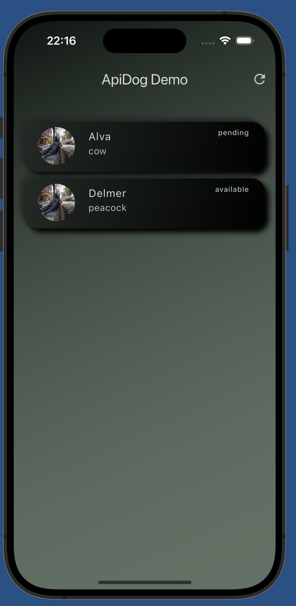
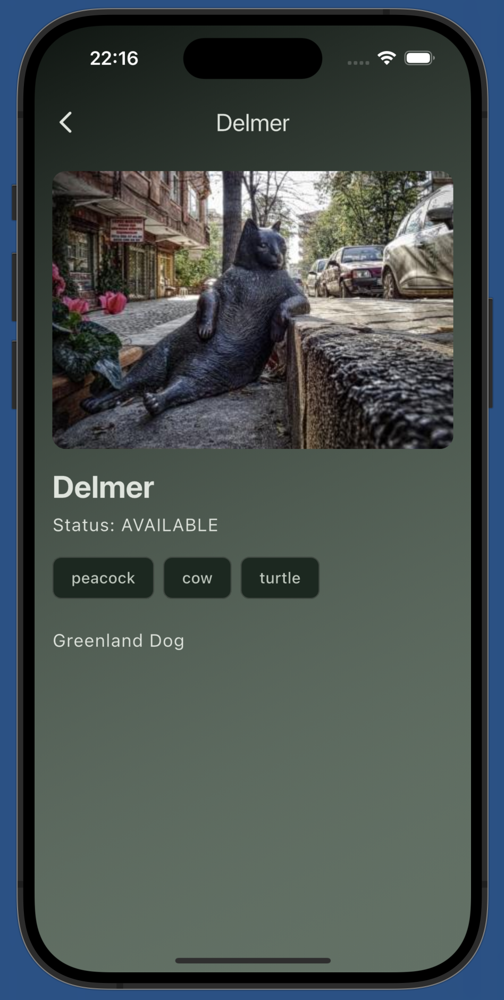

# 🐶 ApiDog Flutter Demo

**ApiDog Flutter Demo** is a sample Flutter app built using **Clean Architecture** principles to demonstrate how to consume a REST API using ApiDog in a modular, reusable, and scalable way.

> ⚙️ Built with `Provider`, `flutter_dotenv`, and a layered architecture: `core`, `domain`, `data`, and `presentation`.

---

## 🚀 Features

- ✅ Fetch a single `Pet`
- ✅ Fetch a list of `Pet`s
- ✅ Environment management via `.env` files
- ✅ Proper separation of concerns through **Clean Architecture**
- ✅ Centralized error handling using `Failure` and `Exception` classes
- ✅ Generic API response handling with `ApiResponse<T>`

---

## 📁 Project Structure

```
lib/
├── core/
│   └── error/              → Error and exception handling
├── data/
│   ├── datasources/        → API services (http requests)
│   └── repositories/       → Repository implementations
├── domain/
│   ├── entities/           → Models and generic API responses
│   ├── repositories/       → Abstract repository interfaces
│   └── usecases/           → Reusable business logic
├── presentation/
│   ├── providers/          → State management
│   └── screens/            → UI layer (main screen)
└── main.dart               → App entry point and config
```

---

## 🌐 Environment Configuration with `flutter_dotenv`

This project uses [`flutter_dotenv`](https://pub.dev/packages/flutter_dotenv) to manage multiple environments such as development, staging, and production.

### 1. 📁 Create an `environment/` folder in the root of your project

```
your_project/
└── environment/
    ├── .env.dev
    ├── .env.local
    └── .env.prod
```

### 2. ✏️ Add the `API_URL` variable to each `.env` file

Example `.env.dev`:

```
API_URL=https://dev.api.apidog.com
```

Example `.env.prod`:

```
API_URL=https://api.apidog.com
```

### 3. ⚙️ Load the env file in `main.dart`

By default, `main.dart` loads the `.env.local` file:

```dart
await dotenv.load(fileName: 'environment/.env.local');
final apiUrl = dotenv.env['API_URL']!;
```

> 💡 You can change which `.env` file to load based on the environment or flavor you want to run.

### 4. 🗂 Use Static JSON for Local Testing (Optional)

If you want to **mock API responses using local static JSON files**, such as:

- `assets/mock/pet_response.json` → for a single pet detail  
- `assets/mock/pet_list_response.json` → for the list of pets

you can toggle this behavior using a `JSON_DATA` variable in your `.env` files.

#### Example:

```env
# .env.local, .env.dev, or .env.prod
JSON_DATA=true

> ℹ️ **Behavior based on `JSON_DATA` value**  
>
> - When `JSON_DATA=true`, the app will **load data from local static JSON files** instead of making real API calls.  
> - When `JSON_DATA=false`, the app will **use the live API** defined in the `API_URL` variable.

---

## 🧪 How to Run

### ✅ Start the app

1. Make sure your `.env` files are created inside the `environment/` folder
2. Run the app:

```bash
flutter pub get
flutter run
```

---

## 💡 Extensibility

You can easily extend this project by adding more models and endpoints:

- Create a new `Entity` class
- Add a new `Service` and `RepositoryImpl`
- Inject a new `FetchApiData<T>` use case into your Provider

---

## 📷 Screenshots

| Home Screen | Detail |
|-------------|----------------|
|  |  |

---

## 📦 Main Dependencies

- [`http`](https://pub.dev/packages/http) – for HTTP requests
- [`provider`](https://pub.dev/packages/provider) – for state management
- [`flutter_dotenv`](https://pub.dev/packages/flutter_dotenv) – for environment variable handling
- [`json_annotation`](https://pub.dev/packages/json_annotation) – for JSON annotation
- [`json_serializable`](https://pub.dev/packages/json_serializable) – for JSON serialization

---

## 🤝 Contributing

Have an idea or a bug fix? Feel free to open a pull request! ❤️

---

## 📄 License

MIT License © 2025 Gionata Stante / Open Reply
